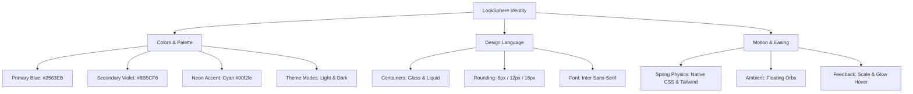

<div align="right">Last Modified: 2026-06-23</div>


# LookSphere — Visual Design Specification

This document defines the branding guidelines, design tokens, layout variables, and asset specifications for the LookSphere platform.

---

## 1. Core Color System

LookSphere uses custom CSS variables defined in main.css to handle brand styling and light/dark mode transitions.

### A. Brand Accent Colors

These accent colors are identical in both light and dark modes:

| CSS Variable      | Color | HEX Value | Application                                        |
| :---------------- | :---: | :-------- | :------------------------------------------------- |
| `--primary-50`    | <span style="background-color:#EFF6FF; width:16px; height:16px; display:inline-block; border-radius:4px; border:1px solid #ccc"></span> | `#EFF6FF` | Subtle badge backgrounds & text highlights         |
| `--primary-100`   | <span style="background-color:#DBEAFE; width:16px; height:16px; display:inline-block; border-radius:4px; border:1px solid #ccc"></span> | `#DBEAFE` | Light accent surfaces & secondary badge indicators |
| `--primary-500`   | <span style="background-color:#3B82F6; width:16px; height:16px; display:inline-block; border-radius:4px; border:1px solid #ccc"></span> | `#3B82F6` | Status icons, spinners, active indicators          |
| `--primary-600`   | <span style="background-color:#2563EB; width:16px; height:16px; display:inline-block; border-radius:4px; border:1px solid #ccc"></span> | `#2563EB` | Primary buttons, logo gradient start               |
| `--primary-700`   | <span style="background-color:#1D4ED8; width:16px; height:16px; display:inline-block; border-radius:4px; border:1px solid #ccc"></span> | `#1D4ED8` | Hover states on primary buttons                    |
| `--secondary-500` | <span style="background-color:#8B5CF6; width:16px; height:16px; display:inline-block; border-radius:4px; border:1px solid #ccc"></span> | `#8B5CF6` | Brand violet accent, logo gradient middle          |
| `--secondary-600` | <span style="background-color:#7C3AED; width:16px; height:16px; display:inline-block; border-radius:4px; border:1px solid #ccc"></span> | `#7C3AED` | Secondary button hover, active gradient accent     |

#### Logo & Hero Text Gradient

- **Angle**: 135deg (to top-right)
- **Stops**: `var(--primary-600)` (`#2563EB`) → `var(--secondary-500)` (`#8B5CF6`) → `#60A5FA` (Light Blue)

---

### B. Theme-Aware Colors

Colors automatically transition based on the `.dark` class on the `<html>` element:

| Token              | Light Mode | Dark Mode (Default) | Usage                                   |
| :----------------- | :--------- | :------------------ | :-------------------------------------- |
| `--bg-primary`     | <span style="background-color:#FFFFFF; width:16px; height:16px; display:inline-block; border-radius:4px; border:1px solid #ccc"></span> `#FFFFFF` | <span style="background-color:#09090B; width:16px; height:16px; display:inline-block; border-radius:4px; border:1px solid #555"></span> `#09090B` | Primary background                      |
| `--bg-secondary`   | <span style="background-color:#F8FAFC; width:16px; height:16px; display:inline-block; border-radius:4px; border:1px solid #ccc"></span> `#F8FAFC` | <span style="background-color:#111827; width:16px; height:16px; display:inline-block; border-radius:4px; border:1px solid #555"></span> `#111827` | Content wrapper / cards wrapper         |
| `--bg-tertiary`    | <span style="background-color:#F1F5F9; width:16px; height:16px; display:inline-block; border-radius:4px; border:1px solid #ccc"></span> `#F1F5F9` | <span style="background-color:#18181B; width:16px; height:16px; display:inline-block; border-radius:4px; border:1px solid #555"></span> `#18181B` | Secondary details / inputs bg           |
| `--text-primary`   | <span style="background-color:#0F172A; width:16px; height:16px; display:inline-block; border-radius:4px; border:1px solid #ccc"></span> `#0F172A` | <span style="background-color:#F8FAFC; width:16px; height:16px; display:inline-block; border-radius:4px; border:1px solid #555"></span> `#F8FAFC` | Headings and primary copy               |
| `--text-secondary` | <span style="background-color:#334155; width:16px; height:16px; display:inline-block; border-radius:4px; border:1px solid #ccc"></span> `#334155` | <span style="background-color:#CBD5E1; width:16px; height:16px; display:inline-block; border-radius:4px; border:1px solid #555"></span> `#CBD5E1` | Body text                               |
| `--text-muted`     | <span style="background-color:#64748B; width:16px; height:16px; display:inline-block; border-radius:4px; border:1px solid #ccc"></span> `#64748B` | <span style="background-color:#94A3B8; width:16px; height:16px; display:inline-block; border-radius:4px; border:1px solid #555"></span> `#94A3B8` | Captions, placeholders, disabled states |
| `--surface-card`   | <span style="background-color:#FFFFFF; width:16px; height:16px; display:inline-block; border-radius:4px; border:1px solid #ccc"></span> `#FFFFFF` | <span style="background-color:#18181B; width:16px; height:16px; display:inline-block; border-radius:4px; border:1px solid #555"></span> `#18181B` | Individual item cards                   |
| `--surface-input`  | <span style="background-color:#F8FAFC; width:16px; height:16px; display:inline-block; border-radius:4px; border:1px solid #ccc"></span> `#F8FAFC` | <span style="background-color:#27272A; width:16px; height:16px; display:inline-block; border-radius:4px; border:1px solid #555"></span> `#27272A` | Interactive inputs                      |
| `--surface-hover`  | <span style="background-color:#F1F5F9; width:16px; height:16px; display:inline-block; border-radius:4px; border:1px solid #ccc"></span> `#F1F5F9` | <span style="background-color:#27272A; width:16px; height:16px; display:inline-block; border-radius:4px; border:1px solid #555"></span> `#27272A` | Hover state background                  |
| `--border-light`   | <span style="background-color:#E2E8F0; width:16px; height:16px; display:inline-block; border-radius:4px; border:1px solid #ccc"></span> `#E2E8F0` | <span style="background-color:#3F3F46; width:16px; height:16px; display:inline-block; border-radius:4px; border:1px solid #555"></span> `#3F3F46` | Subtle separators                       |
| `--border-normal`  | <span style="background-color:#CBD5E1; width:16px; height:16px; display:inline-block; border-radius:4px; border:1px solid #ccc"></span> `#CBD5E1` | <span style="background-color:#27272A; width:16px; height:16px; display:inline-block; border-radius:4px; border:1px solid #555"></span> `#27272A` | Card borders, secondary borders         |

---

### C. Status Colors

| Category    | Token              | Light Color | Light HEX | Dark Color | Dark HEX  | Application                             |
| :---------- | :----------------- | :---------- | :-------- | :--------- | :-------- | :-------------------------------------- |
| **Success** | `--status-success` | <span style="background-color:#16A34A; width:16px; height:16px; display:inline-block; border-radius:4px; border:1px solid #ccc"></span> | `#16A34A` | <span style="background-color:#22C55E; width:16px; height:16px; display:inline-block; border-radius:4px; border:1px solid #555"></span> | `#22C55E` | Positive alert states, success messages |
| **Error**   | `--status-error`   | <span style="background-color:#DC2626; width:16px; height:16px; display:inline-block; border-radius:4px; border:1px solid #ccc"></span> | `#DC2626` | <span style="background-color:#EF4444; width:16px; height:16px; display:inline-block; border-radius:4px; border:1px solid #555"></span> | `#EF4444` | Invalid forms, failure messages         |
| **Warning** | `--status-warning` | <span style="background-color:#D97706; width:16px; height:16px; display:inline-block; border-radius:4px; border:1px solid #ccc"></span> | `#D97706` | <span style="background-color:#F59E0B; width:16px; height:16px; display:inline-block; border-radius:4px; border:1px solid #555"></span> | `#F59E0B` | Confirmations, warnings                 |
| **Info**    | `--status-info`    | <span style="background-color:#0891B2; width:16px; height:16px; display:inline-block; border-radius:4px; border:1px solid #ccc"></span> | `#0891B2` | <span style="background-color:#06B6D4; width:16px; height:16px; display:inline-block; border-radius:4px; border:1px solid #555"></span> | `#06B6D4` | Information highlights, tooltips        |

---

## 2. Layout, Typography & Motif Specs

### A. Breakpoints & Border Radii

- **Custom Breakpoints**:
  - `xsm`: 480px
  - `mdlg`: 900px
  - `3xl`: 1600px
  - `4xl`: 1920px
- **Border Radius**:
  - `--radius-sm`: `8px` (inputs, small buttons, tags)
  - `--radius-md`: `12px` (profile avatars, dropdowns)
  - `--radius-lg`: `16px` (main cards, modal containers)

### B. Typography

- **Font Family**: `Inter` (Sans-Serif)
- **Weights**: `400` (Regular), `500` (Medium), `600` (Semi-bold), `700` (Bold)

### C. Glassmorphism Utilities

- **`.glass`**: Backlight blur overlay `blur(16px)` / `saturate(180%)` with soft borders.
- **`.liquid-glass`**: High-blur background `blur(24px)` / `saturate(200%)` with translucent inset shadows for menus, dropdowns, and cards.

### D. Touch & Mobile Device Constraints (GPU Rasterization)

Due to rendering constraints on mid-tier mobile processors (specifically the Mali-G52 GPU family) and Chrome's GPU Rasterization engine, the standard glassmorphism UI degrades into horizontal tearing and black artifacts during scroll. To ensure visual stability, the following design overrides are applied to all touch-capable devices via `@media (pointer: coarse)`:

1. **Backdrop Filters Disabled**: `backdrop-filter: blur(...)` and `saturate(...)` are entirely removed from `.glass` and `.liquid-glass` utilities.
2. **Solid Background Fallbacks**: Transparent `rgba` colors are overridden with 100% opaque, solid background colors (`var(--bg-secondary)`, `var(--surface-card)`) to prevent the GPU from calculating alpha-blending across complex underlying `linear-gradient` orbs.
3. **Border Removal**: Vector borders (specifically translucent 1px borders) are disabled on all feed cards and layout wrappers, as sub-pixel anti-aliasing during scrolling causes compositor layout thrashing.
4. **Animation Simplification**: Hover animations (like `-translate-y-1` floating cards) are disabled, and heavy `blur-md` effects on `CardGlow` components are replaced with simple opacity transitions.

*Design Principle for Touch:* On touch interfaces, prioritize solid, high-contrast surfaces over layered translucency to maintain a 60fps scroll experience without visual artifacting.

### E. Animations & Easing

- **Background Floating Orbs**: Three ambient blurred gradient divs (electric blue, violet, cyan) orbiting at opacities of `0.15` (dark) and `0.06` (light) using `float-orb-1`, `float-orb-2`, and `float-orb-3` keyframes.
- **Scroll Parallax**: Scroll-driven y-transform offsets for background layers.
- **Hover Interaction**: Micro-scaling (`scale(1.025)`) and smooth glow transitions on button active paths.

---

## 3. Brand Favicon

- **Asset Location**: `/favicon.png` (within `public/` directory)
- **Asset Theme**: Abstract Gradient Sphere matching the app's signature orbs.
- **HTML Reference**:
  ```html
  <link rel="icon" type="image/png" href="/favicon.png" />
  ```

---

## 4. Visual Identity Hierarchy



---
**📚 LookSphere Documentation Index:**
- **Root:** [Main Readme](../Readme.md) | [File Tree](../File_Tree.md) | [Roadmap](../roadmap.md) | [Performance](../performance_optimization.md) | [Resolved Issues](../resolved_issues.md)
- **Frontend:** [Frontend Readme](./README.md) | [Design Specs](./Design.md) | [Frontend File Tree](./File_Tree.md) | [Improvements](./improvement.md)
- **Backend:** [Backend Readme](../Backend/Readme.md) | [API Docs](../Backend/APIs.md) | [Backend File Tree](../Backend/File_Tree.md)
---
